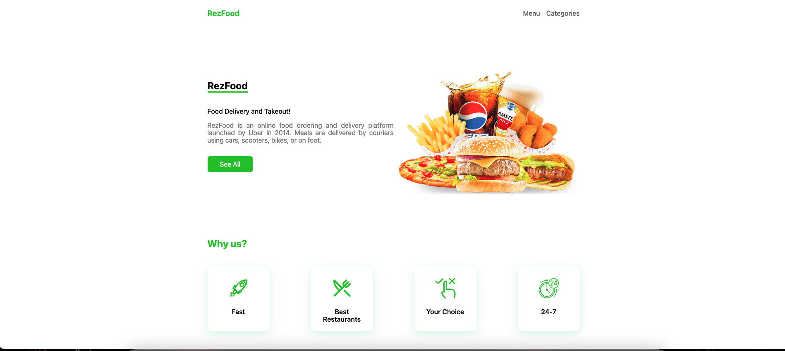

# RezFood

A Next.js project, utilizing `SSG` and `SSR` for create pages.


## Features

- **Filter By Query**
- **State Management**: Leveraging `useState` and `Context` for efficient state management.
- **Get Static Props**
- **Get Static Paths**
- **Get Server Side Props**

## Technologies Used

- **Next.js**
- **Server-json**

## Getting Started

1. Clone the repository:

   ```bash
   git clone https://github.com/rezaansarirad/Rez-Food.git
   ```

2. Install dependencies:

   ```bash
   npm install
   ```

3. Run the project:

   ```bash
   npm start
   ```

## Screenshots



<!-- Add more screenshots if needed -->

## Contributing

Feel free to contribute to the project by opening issues or creating pull requests. Your feedback and suggestions are highly appreciated.

Hope you enjoy.
